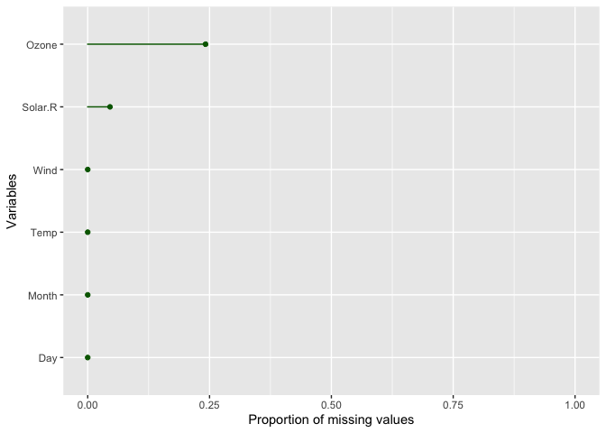

<!-- README.md is generated from README.Rmd. Please edit that file -->

# rmiss

<!-- badges: start -->
<!-- badges: end -->

The goal of rmiss is to help visualize missing values in data frames.
This package contains a convenience function to make a ggplot to
visualize the proportion of missing values for all or selected columns
in a given data frame.

## Installation

You can install the development version of rmiss from
[GitHub](https://github.com/) with:

``` r
# install.packages("devtools")
devtools::install_github("stat545ubc-2023/rmiss")
```

## Example

This is a basic example which shows you how to use the
`plot_missing_values_proportions()` function to visualize the proportion
of missing values for all columns in a data frame called *airquality*.

``` r
library(rmiss)
# Create the plot for all variables in airquality (a dataset in Base R)
plot_missing_values_proportions(df=airquality, point_color = 'darkgreen', line_color = 'darkgreen')
```



We can also choose to visualize the proportion of missing values for
some selected columns in the *airquality* dataset by specifying column
names using the `vars` argument.

``` r
plot_missing_values_proportions(df=airquality, vars = c(Ozone, Wind, Temp))
```


